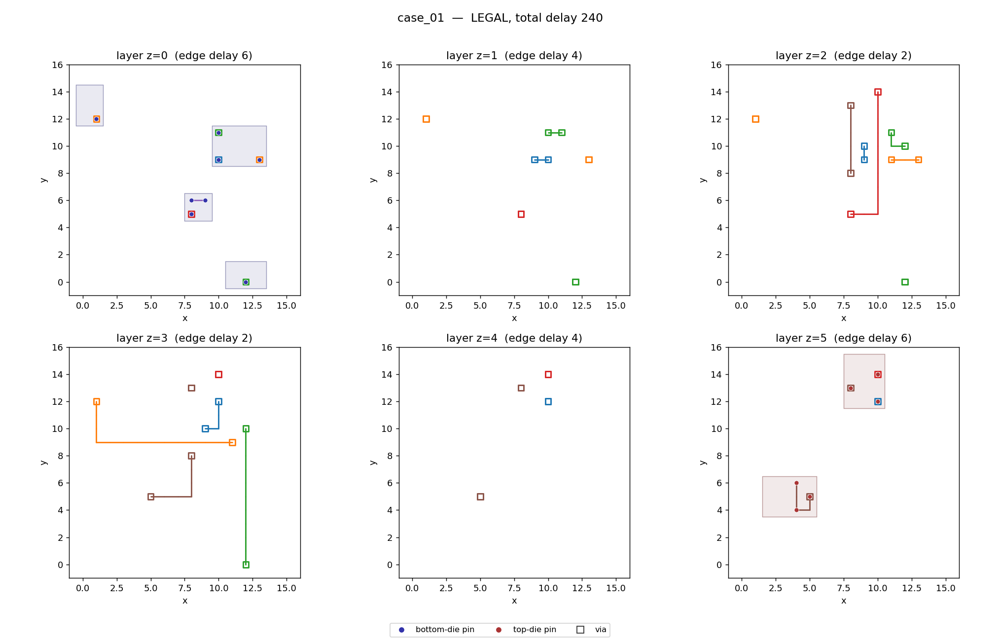

# M3D Routing Challenge

A small, reproducible EDA routing challenge for a **simplified monolithic-3D
integration stack**. Two dies sit face to face with a shared vertical stack of
routing layers between them. Participants connect cell pins across a 3D grid
graph while **minimizing total routing delay** under a simple additive delay
model.

Everything here is self-contained and pure standard library (only the
visualization needs `matplotlib`). The repository ships a deterministic
benchmark generator, 20 generated cases each with a **verified legal reference
solution**, an independent legality checker and scorer, a baseline router, a
visualization tool, an example participant router, and tests.



*case_01 across its six routing layers. Edge delay is lowest on the middle
layers (2) and highest next to the dies (6), so long connections dive to the
middle of the stack. Cells are shaded on the die layers (z=0 bottom, z=5 top);
pins are dots colored by die; vias are open squares; nets are colored.*

---

## 1. The model

### Physical model

* Two dies — **bottom = die 0**, **top = die 1** — share one rectangular,
  grid-aligned XY coordinate system of size `width x height`.
* Between them is a stack of `layers` routing layers, `z = 0 .. layers-1`. The
  number of layers is **configurable** (default 6).
* Rectangular, grid-aligned cells are placed without overlap on each die. Cells
  on *opposite* dies may overlap in XY. Each cell carries one or more
  grid-aligned pins.
* **Bottom-die pins live on layer `z = 0`; top-die pins live on layer
  `z = layers-1`.**
* Routing is a **3D grid graph**. A vertex is `(x, y, z)`. Legal moves:
  * one grid step in **X or Y on the same layer**, or
  * a **via to an adjacent layer** at the same XY.
  No diagonal moves, no skipped layers.
* In this first model, **cell footprints do not obstruct** the routing layers.
  The only routing obstacles are other nets' pins (see legality).

### Delay model (abstract, additive)

This is an **abstract additive delay objective**, not electrical timing
analysis. There is no capacitance, slew, buffering, loading, or
congestion-dependent delay.

* Each routing **layer** has a constant positive integer delay per grid edge.
  The default profile is **symmetric about the middle** of the stack, **lowest
  in the middle** and **highest next to either die**:
  `layer_delay[z] = center_delay + slope * |2z - (layers-1)|`.
* Each **via** between adjacent layers has a constant positive integer delay.
* All delay values are stored **explicitly in every instance** (`layer_delay`,
  `via_delay`), and delays are integers so scoring is exact and deterministic.

### Nets and the objective

* Nets connect cell pins; a net may be **same-die or cross-die** (spanning both
  dies), **two-pin or multi-pin**. Proportions and fanout are configurable.
* Each net has exactly **one driver and one or more sinks**. **Every pin belongs
  to exactly one net.**
* A submitted route for a net must be a **connected, acyclic tree** that spans
  all of the net's pins, so every driver→sink path is unambiguous.
* **Total routing delay** = the sum, over all sinks of all nets, of the delay of
  the driver→sink path through that net's tree. A shared segment contributes to
  **each** sink path that traverses it.
* **Objective: minimize total routing delay while routing every net legally.**

### Routing legality

* Each routing-grid **vertex** and **edge** may belong to **at most one net**.
* **Branches of the same net may share** vertices and edges (a tree already
  does).
* Different nets may cross in XY on **different layers**, as long as they share
  no 3D vertex or edge.
* A **via occupies its two endpoint vertices and the edge between them**.
* A route **may not pass through another net's pin**.
* All routes must stay within the grid and layer bounds and use only legal
  moves.

A submission is **rejected** (illegal, non-competitive) if it has any
disconnected pin, missing net, short, resource conflict, cycle, invalid
coordinate, or illegal layer transition. **Partial routing does not earn a
competitive score.**

---

## 2. Repository layout

```
m3d/                 the toolkit (pure stdlib)
  model.py           data model, delay profile, JSON I/O
  grid.py            3D grid moves used by the router
  generator.py       deterministic, verified-feasible benchmark generator
  checker.py         independent legality checker + delay recomputation
  scorer.py          per-case scoring + normalized leaderboard
  baseline.py        baseline router (Dijkstra trees + rip-up-and-reroute)
  suite.py           the released 20-case suite (seeds + size ladder)
  viz.py             matplotlib visualization
  cli.py             command-line entry point
benchmarks/          the 20 generated cases + suite.json manifest
  case_01.json ...   participant-facing instances
  reference/         verified reference solutions (kept separate from inputs)
examples/            example participant router + a scored example submission
tests/               unit + end-to-end tests
docs/                images and the format reference (FORMATS.md)
```

---

## 3. Quick start

Requires Python 3.8+. For visualization: `pip install -r requirements.txt`
(matplotlib). Run all commands from the repository root.

```bash
# regenerate the 20-case suite deterministically (writes benchmarks/)
python -m m3d.cli generate --out benchmarks

# run the baseline router on one case
python -m m3d.cli baseline --case benchmarks/case_01.json --out my.sol.json

# evaluate a submission (legality + delay + ratio vs baseline)
python -m m3d.cli evaluate --case benchmarks/case_01.json --sol my.sol.json --suite benchmarks

# score a full 20-case submission (leaderboard)
python -m m3d.cli score-suite --suite benchmarks --submission-dir examples/submissions

# visualize a case (all layers, or one layer with --layer N)
python -m m3d.cli visualize --case benchmarks/case_01.json --sol benchmarks/reference/case_01.sol.json --out case_01.png

# print a case summary
python -m m3d.cli info --case benchmarks/case_10.json

# run the tests
python -m unittest discover -s tests -t .
```

A `Makefile` wraps the common commands: `make generate`, `make baseline`,
`make score-example`, `make visualize`, `make test`.

---

## 4. How to participate

1. Read each instance (`benchmarks/case_NN.json`): grid, layers, delays, cells,
   pins, and nets.
2. For each net, produce a **tree of routing edges** connecting the driver to
   all sinks, obeying the legality rules above.
3. Write a submission JSON per case (`case_NN.sol.json`) in the submission
   format (below). Put all 20 in one directory.
4. Score locally:
   `python -m m3d.cli score-suite --suite benchmarks --submission-dir <your_dir>`.

A **complete ranked submission must be legal on all 20 cases.** See
`examples/example_submission.py` for a minimal, self-contained router you can
copy and replace with your own algorithm — it demonstrates loading, routing on
the shared grid, self-checking, and writing a submission.

### File formats (summary; full spec in `docs/FORMATS.md`)

**Instance** (`case_NN.json`, `format: m3d-instance`): grid `{width,height,layers}`,
`delay {layer_delay:[...], via_delay}`, `cells`, `pins` (`id, cell, die, x, y, z`),
`nets` (`id, driver, sinks:[...]`), plus generation `params` and `seed`.

**Submission** (`format: m3d-submission`): `instance` name and `routes`, a list of
`{net, edges}` where each edge is a pair of vertices `[[x1,y1,z1],[x2,y2,z2]]`.

**Result** (`format: m3d-result`): `legal`, `total_delay`, per-net `{legal, delay,
reasons}`, global `reasons`, and `conflict_vertices` / `conflict_edges` for
visualization of invalid submissions.

The evaluator **independently reconstructs and validates every route and
recomputes the delay** from the instance; it never trusts participant-reported
metrics.

---

## 5. Scoring

* Per case the checker reports the **raw total delay** it recomputes.
* The aggregate **leaderboard** normalizes each case against the baseline so the
  largest case cannot dominate by size. For a legal case with total `s_c` and
  baseline total `b_c`, the per-case ratio is `b_c / s_c` (a ratio above 1 beats
  the baseline). The aggregate is the **geometric mean** of the ratios:

  ```
  aggregate = ( product over cases of (baseline_total / submission_total) ) ** (1 / N)
  ```

  Higher is better; the baseline scores exactly **1.0**. A submission must be
  **legal on all 20 cases** to be complete and ranked — otherwise it is marked
  incomplete with aggregate `0.0`.
* **Runtime** is recorded separately (pass a `{case: seconds}` JSON via
  `--runtimes`) and never affects the delay score. Runtime limits are a
  deployment policy, applied when you run a router, not part of legality.

The baseline itself is the normalization reference; its per-case totals are in
`benchmarks/suite.json`.

---

## 6. The baseline router

`m3d/baseline.py` is a deliberately simple, deterministic reference: it routes
nets one at a time (largest bounding box first), grows each net as a shortest
(minimum-delay) tree with multi-source Dijkstra, enforces hard capacity, and
uses **rip-up-and-reroute** when a net is blocked. It is not state of the art;
it exists to establish a usable reference score and to certify that generated
instances are routable. Beating it is the point.

---

## 7. Reproducibility and design choices

* **Determinism.** The suite uses a fixed master seed (`20260923`) and a
  reproducible per-case seed schedule (`m3d/suite.py`). Generation uses Python's
  `random.Random` (Mersenne Twister), stable across CPython versions for a given
  seed and call sequence. Delays are integers, so scoring is exact.
* **Verified feasibility.** Every released instance is generated and then routed
  by the baseline and validated by the independent checker; candidates without a
  checker-verified legal solution are discarded and regenerated. The verified
  reference solution lives in `benchmarks/reference/`, separate from the
  participant inputs, and doubles as the scoring baseline. (A router's failure is
  not treated as proof of infeasibility — we only *accept* an instance once a
  legal solution is in hand.)
* **Documented simplifications.** Cell footprints do not obstruct routing (only
  other nets' pins do); the delay model is abstract and additive (no electrical
  effects); capacity is a simple one-net-per-resource model. These keep the
  challenge correct and reproducible end to end; richer models are natural future
  extensions.
* **Configurable.** Grid size, layer count, cell counts/sizes, pins per cell,
  net count, fanout distribution, cross-die fraction, locality, and all delays
  are configurable (`m3d/generator.py::GenConfig`, `m3d/suite.py`). The routing
  layer count and benchmark sizes are intentionally easy to change.

## License

MIT — see `LICENSE`.
